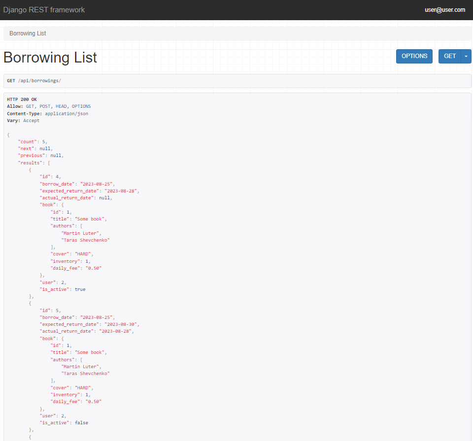

#BookNest API: Your Library Connection

## library_service_project

Project Description:
This is an api library service where you can borrow books and the system 
itself will do everything for you. The system also keeps a record of books,
borrowing, users. There are options to check the availability of specific 
books in the library. The system allows you to optimize the work of library
administrators, and also gives you the opportunity to check who returned 
the book on time and who did not.

### Documentation on Swagger
.../api/doc/swagger/

### Installation

Python3 must be already installed

```shell
git clone https://github.com/YehorKorn/library_service_project.git
cd library_service_project.git
python3 -m venv venv
source venv/bin/activate
pip install -r requirements.txt
python manage.py migrate
python manage.py runserver
```

- Next activate your venv 
  - `venv\Scripts\activate` (on Windows)
  - `source venv/bin/activate` (on macOS)

For initial db use this command `python manage.py migrate`

## Features

* Authentication JWT functional for User/Admin
* Api Book:
  * For AnonUser-------------list/detail
  * For AdminUser-------------list/create/detail/update/delete
* Api Borrowing:
  * For AuthUser--------------list/create/detail/return(if you owner)
    * Filtering by is_active
  * For AuthUser--------------list/create/detail/update/delete/return
    * Filtering by user_is & is_active


## Demo


